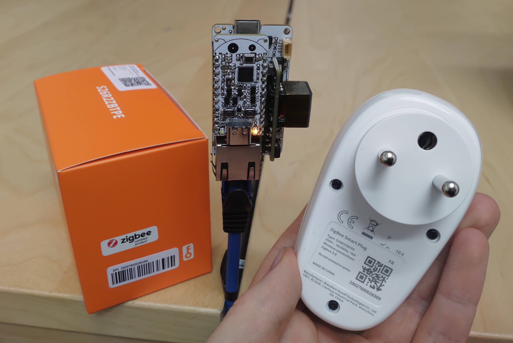

# Esp32-C6-Bug-Arduino-Examples
Hello Internet traveller!
You have just arrived to the repository containing Arduino code examples for Esp32-C6-Bug and Esp32-Eth-Bug development boards.
## Arduino IDE support
The official Arduino support for the Esp32-C6 chip is now ready (check out arduino-esp32 version 3.0.0). To install it you should insert index.json link([Stable](https://espressif.github.io/arduino-esp32/package_esp32_index.json) or [Development](https://espressif.github.io/arduino-esp32/package_esp32_dev_index.json)(Supports Esp32-C6 as of 5.2.2024)) taken from [the official docs](https://docs.espressif.com/projects/arduino-esp32/en/latest/installing.html)
Into the preferences tab of Arduino IDE. After it's done the core will be available to download via Boards Manager.
Some examples are covered more in details in [Esp32-C6-Bug datasheet](https://github.com/allexoK/Esp32-C6-Bug-Docs/blob/main/esp32c6bugdatasheet.pdf)
When compiling the examples ensure that:
- The Board option in tools tab is set to 'ESP32C6 Dev Module'
- USB CDC On Boot option in tools tab is set to 'True'
- Port option in tools tab is set to the port, where you connected your board.
## Quick examples description
- esp32c6bugblink - The first example demonstrates the basic blinking functionality, nothing fancy, but a good way to start. 
    - Parts needed:
        - Esp32-C6-Bug
- esp32c6bugethernet - The second example utizes the Ethernet to connect to the Internet, use it to ensure that Esp32-Bug-Eth is working.
    - Parts needed:
        - Esp32-C6-Bug
        - Esp32-Bug-Eth
- esp32c6bugplusSH1106_128x64_i2c_QTPY - For this example, you will need some kind of OLED display based around SH1106 driver. If it has Stemma QT connector you can connect it to Esp32-Bug-Eth via it(Alternatively just connect display SDA->pin 21, display SCL->pin 20). The code prints basic 'hello world' style message.  
    - Parts needed:
        - Esp32-C6-Bug
        - Some Oled with SH1106 driver
        - optional: Esp32-Bug-Eth
- esp32c6bugethernetbmp280telegrambot - This example is more advanced and more 'open-ended,' but it is my personal favorite. It uses Ethernet to connect to the Internet, reads data from a BMP280 sensor (which you can later replace with any other sensor or combination of sensors), and sends it to you via Telegram messenger if the data exceeds a certain limit (temperature range: 20-30 °C). You can follow [this](https://randomnerdtutorials.com/telegram-control-esp32-esp8266-nodemcu-outputs/) tutorial to obtain the Telegram token and Chat ID defined in the code.
I personally love this example because I see it as a stepping stone to some interesting experiments. Imagine a group of sensors 'writing' data to a Telegram chat, and an AI like ChatGPT reading the sensor data from the chat and commanding other IoT devices to perform actions (like issuing an 'open the window' command via the same chat). Can it handle the data like this? Will it open the window if the temperature is too hot? What is the maximum number of 'inputs' and 'outputs' it can handle? No one knows since the technology is quite new. Maybe you will be the first person to find out?
    - Parts needed:
        - Esp32-C6-Bug
        - BMP280 sensor(Something with Stemma QT works best)
        - Esp32-Bug-Eth

- esp32c6bugzigbeemqttbridge - The example demonstrates a simple Zigbee to MQTT bridge for light bulbs. The Esp32-C6-Bug+Esp32-Bug-Eth combo works as a Zigbee coordinator and a PoE-Powered Ethernet MQTT client. After the client receives a message from the broker on the 'test/light' topic, it turns on/off all the connected light bulbs. The example can be the first stepping stone for building an Esp32-C6-Bug Arduino Zigbee To MQTT Bridge! Don't forget to set your MQTT credentials in Zigbee_Mqtt_Light_Bridge.ino. Also, you will need the Arduino core with Zigbee support (as of 24/02/2024, the support is already in the master branch).
    - Parts needed:
        - Esp32-C6-Bugx2(Also tested with Sonoff s26r2zbtpe smart socket as End device)
        - Esp32-Bug-Eth

## ESP-IDF examples
If you are also interested in advanced features of Esp32-C6 like Zigbee and thread please refer to [Official examples](https://github.com/espressif/esp-idf/tree/release/v5.1/examples) and to Demos section of [Esp32-C6-Bug datasheet](https://github.com/allexoK/Esp32-C6-Bug-Docs/blob/main/esp32c6bugdatasheet.pdf) 
